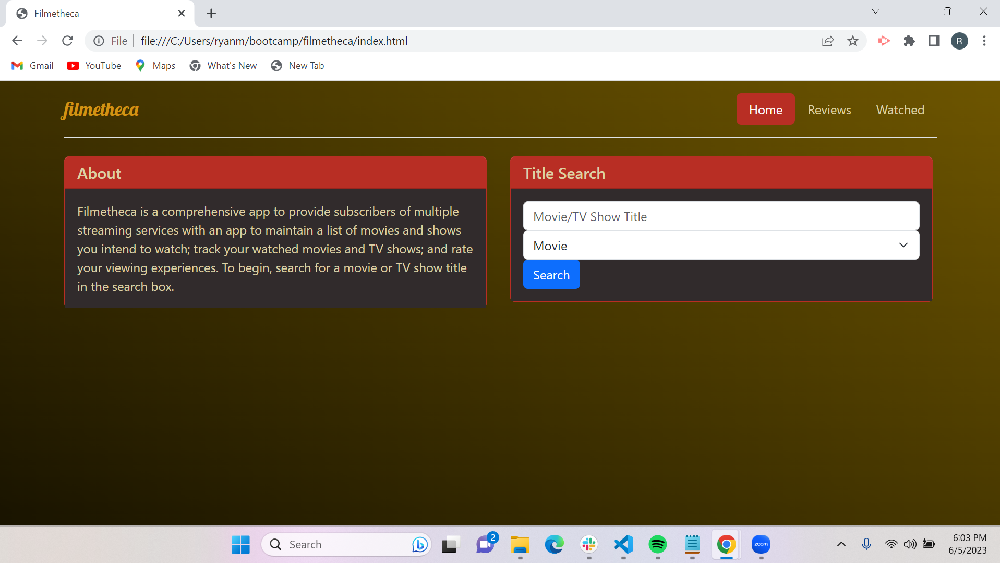

# Filmetheca
Filmetheca is a website that assists subscribers to multiple streaming services in organizing their movie and TV show preferences. It allows users to keep track of the movies and shows they have watched, rate their viewing experiences, and read reviews of different shows/movies.
## Table of Contents
- [Problem Statement](#problem-statement)
- [Solution](#solution)
- [Mission Statement](#mission-statement)
- [Features](#features)
- [APIs/Frameworks/Libraries](#apis-frameworks-libraries)
- [Target Audience](#target-audience)
- [User Stories](#user-stories)
- [Research](#research)
## Problem Statement
Subscribers to multiple streaming services often struggle to keep track of the movies and TV shows they have watched and those they plan to watch. They may inadvertently re-watch content across different platforms, wasting their time and resources. Furthermore, they may want to rate their viewing experiences and access information about where specific movies and shows are available for streaming.
## Solution
Filmetheca provides a comprehensive solution to the aforementioned problem. By utilizing the TMDB REST API, users can search for movies and TV shows, add them to their watched lists, and record the streaming service where they watched. The integration of the OMDB REST API provides additional information such as genre.
## Mission Statement
Our mission is to provide subscribers to multiple streaming services with a comprehensive app that enables them to track their watched movies and shows, rate their viewing experiences, and read reviews. 
## Features
### Minimum Viable Product
- Integration of the TMDB API to search for movies and TV shows, and retrieve information such as title, cast, and genre.
- Integration of the OMDB API to view genre information.
- Ability to add movies and TV shows to a watched list, along with the streaming service where they were watched.
- Ability to rate movies and TV shows on a scale of 1 to 5 stars.
### Future Releases
- Integration with DayJS library to track and display when a particular movie or TV show was watched.
- Link previews, showtimes, and locations for unreleased movies or shows.
- Improved search functionality and filtering options.
- Integration with OMDB to see streaming information.
- Provide a "to watch list" for users.
## APIs/Frameworks/Libraries
- Bootstrap: Front-end framework for responsive and visually appealing design.
- TMDB REST API: Offers comprehensive movie and TV show data, including cast and crew information.
- OMDB REST API: Provides additional information such as genre.
- Google Fonts: Provides a wide variety of fonts for enhancing the visual appeal of the website.
## Target Audience
The target audience of Filmetheca are users who are subscribers to multiple streaming services and who are interested in developing their own personal listing of movies and shows they have watched and want to watch.
## User Stories
### User Story #1
**As a subscriber to multiple streaming services,** I want an app that allows me to track the movies and shows I have watched and the streaming service where I watched them, so that I do not re-watch content on other platforms.
**Acceptance Criteria #1**
- Given that I need a list of movies and shows I have watched,
- When I search for the title of a movie or show,
- Then I can add the searched movie
 or show to a watched list, along with the streaming service where I watched it.
### User Story #2
**As a subscriber to multiple streaming services,** I want an app that allows me to rate the movies and shows I have watched, so that I can keep track of my preferences and experiences.
**Acceptance Criteria #2**
- Given that I have a listing of movies and shows I have watched,
- When I find a movie or show in the list,
- Then I can add a rating between 1 and 5 stars.
### User Story #3
**As a subscriber to multiple streaming services,** I want an app that provides reviews for different movies/shows, so that I have a better idea of which movies/shows I will enjoy watching.
**Acceptance Criteria #3**
- Given that I need information on a given show,
- When I search for the title of a movie or show,
- Then I can see reviews and other information.
## Research
Before starting the implementation, thorough research was conducted to solidify the concept and features of Filmetheca. This research involved studying similar apps like Letterboxd, IMDB, and Fandango to understand their offerings and how Filmetheca could differentiate itself. The research also included exploring various APIs, frameworks, and libraries that could be used to develop the app effectively and efficiently.
## Applicaton 
Down below is a link along with preview of the application itself
 link: https://adamhansen184.github.io/filmetheca/

 Site preview: 
